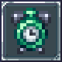

<br/>

# Speedrun Display

---

Speedun Display is a mod that adds an in-game, perfectly accurate speedrun timer to Terraria.
It contains integrated support for Vanilla: Any% and Vanilla: AllBosses% run types, with mod calls available to allow other mod developers to add their own splits/categories.

If you are a mod developer looking to add Speedrun Display support to your mod, check out the documentation below!

## Documentation
All of Speedrun Display's API is publicly facing and available through mod calls.

### Adding/Retrieving Splits/Categories
Split and category adding can be achieved via the following calls:
```cs
// Registers a new split for displaying and/or category completion checking
object split = speedrunDisplay.Call("AddSplit", string splitKey, string localizationKey, Asset<Texture2D> icon, Func<bool> completionCheck);

// Registers a new category for runs to follow
// The last paremeter, 'split', should be the result of an "AddSplit" mod call.
// When the passed in split has its completion check return true, the run ends.
object category = speedrunDisplay.Call("AddCategory", string categoryKey, string localizationKey, object completionSplit);

// Retrieves a split/category
object split = speedrunDisplay.Call("GetSplit", string splitKey);
object category = speedrunDisplay.Call("GetCategory", string categoryKey);

/*
Of note:
The objects returned by all of the above mod calls are of the type implemented by SpeedrunDisplay's code base.
If you want to access specific info from them, there are 3 options:

------
• Casting
You can implicitly cast a returned Split into a */ (string localizationKey, Asset<Texture2D> icon, Func<bool> completionCheck) /*, as well
as cast a returned Category into a */ (string localizationKey, Split completionSplit) /* (where you can replace the 'Split' part with the above cast).
---
• Reflection
If you are capable enough to use reflection, I should not need to explain it here.
---
• Source code referencing.
If you are capable enough for this, I should not need to explain it either.
-----
*/
```

### Retrieving Run Info
To retrieve info about the active run or a previously completed run, you can use the following calls:
```cs
// Whether a run is currently active
bool runActive = (bool)speedrunDisplay.Call("RunActive");

// The key of the currently selected run category
// Note: This can be null if a run is not active.
string? runCategory = (string)speedrunDisplay.Call("RunCategory");

// The current run's already-achieved splits
// Note: splitTime is the number of frames spent on that specific split, whereas runTime is the number of frames into the run that the split was achieved.
(string splitKey, uint splitTime, uint runTime)[] currentSplits = ((string, uint, uint)[])speedrunDisplay.Call("CurrentSplits");

// The last completed run
// Note: This can be null if a run was not just completed.
// Note: The included tuple type follows the same structure as the above call.
(string categoryKey, (string, uint, uint)[] runSplits, TimeSpan igt, TimeSpan rta)? lastCompletedRun = (string, (string, uint, uint)[], TimeSpan, TimeSpan)speedrunDisplay.Call("LastCompletedRun");
```


### Examples
The [Calamity Mod GitHub](https://github.com/CalamityTeam/CalamityModPublic/blob/1.4.4/ModSupport/WeakReferenceSupport.cs) contains some examples of how to add new splits/categories.
You can find a snippet of their code below:
```cs
Mod speedrunDisplay = ExternalMods.speedrunDisplay;
if (speedrunDisplay is null)
  return;

static string Localize(string key) => $"Mods.CalamityMod.Misc.SpeedrunDisplay.{key}";
static Asset<Texture2D> BossHead<T>() where T : ModNPC => TextureAssets.NpcHeadBoss[NPCID.Sets.BossHeadTextures[NPCType<T>()]];

object GetSplit(string splitKey) => speedrunDisplay.Call("GetSplit", splitKey);
object AddSplit(string splitKey, Asset<Texture2D> splitIcon, Func<bool> completionCheck) => speedrunDisplay.Call("AddSplit", splitKey, Localize(splitKey), splitIcon, completionCheck);
object AddCategory(string categoryKey, object completionSplit) => speedrunDisplay.Call("AddCategory", categoryKey, Localize(categoryKey.Replace("%", "Percent")), completionSplit);

AddSplit("DesertScourge", BossHead<DesertScourgeHead>(), DownedDesertScourge);
AddSplit("Crabulon", BossHead<Crabulon>(), DownedCrabulon);
AddSplit("HiveMind", ModContent.Request<Texture2D>("CalamityMod/NPCs/HiveMind/HiveMindP2_Head_Boss"), DownedHiveMind);
AddSplit("Perforators", BossHead<PerforatorHive>(), DownedPerforators);
AddSplit("SlimeGod", BossHead<SlimeGodCore>(), DownedSlimeGod);
// ....

// Cynosure is only available in the "Calamity: Any%" category
AddSplit("Cynosure", ModContent.Request<Texture2D>("CalamityMod/Items/LoreItems/LoreCynosure"), () => (string)speedrunDisplay.Call("runcategory") == "CalamityAny%" && DownedBossSystem.downedCalamitas && DownedBossSystem.downedExoMechs);
AddSplit("CalamityAllBosses", Request<Texture2D>("CalamityMod/icon_small"), () =>
  DownedBossSystem.downedExoMechs &&
  DownedBossSystem.downedCalamitas &&
  DownedBossSystem.downedYharon &&
  DownedBossSystem.downedDoG /* && ....*/);

AddCategory("CalamityAny%", GetSplit("Cynosure"));
AddCategory("CalamityAllBosses%", GetSplit("CalamityAllBosses"));
```

If you have any questions, please don't hesitate to reach out and ask on Discord: @nycro
